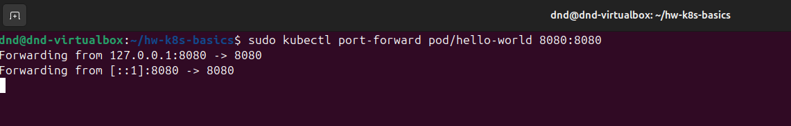
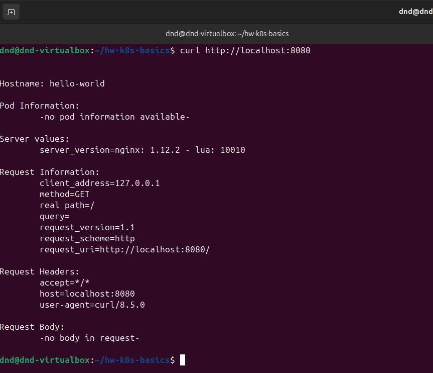
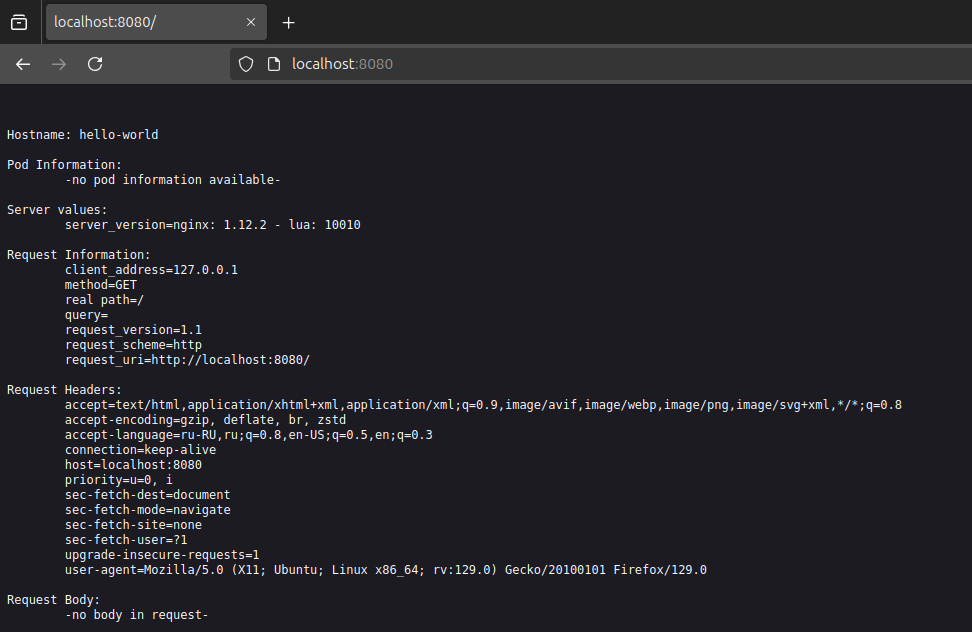

# Домашнее задание к занятию "`Базовые объекты K8S`" - `Дедюрин Денис`

---
## Задание 1. Создать Pod с именем hello-world

1. Создать манифест (yaml-конфигурацию) Pod.
2. Использовать image - gcr.io/kubernetes-e2e-test-images/echoserver:2.2.
3. Подключиться локально к Pod с помощью `kubectl port-forward` и вывести значение (curl или в браузере).

### Ответ:

Создадим манифест со следующим содержимым:

```
apiVersion: v1
kind: Pod
metadata:
  name: hello-world
spec:
  containers:
    - name: echoserver
      image: gcr.io/kubernetes-e2e-test-images/echoserver:2.2
      ports:
        - containerPort: 8080
```
Создаем под и проверяем состояние:

```
sudo kubectl apply -f hello-world-pod.yaml
```
```
sudo kubectl get pods
```


Пробросим порт:

```
sudo kubectl port-forward pod/hello-world 8080:8080
```


Проверим состояние через **curl**:

```
curl http://localhost:8080
```


А так же через браузер:



---
## Задание 2. Создать Service и подключить его к Pod

1. Создать Pod с именем netology-web.
2. Использовать image — gcr.io/kubernetes-e2e-test-images/echoserver:2.2.
3. Создать Service с именем netology-svc и подключить к netology-web.
4. Подключиться локально к Service с помощью `kubectl port-forward` и вывести значение (curl или в браузере).

### Ответ: